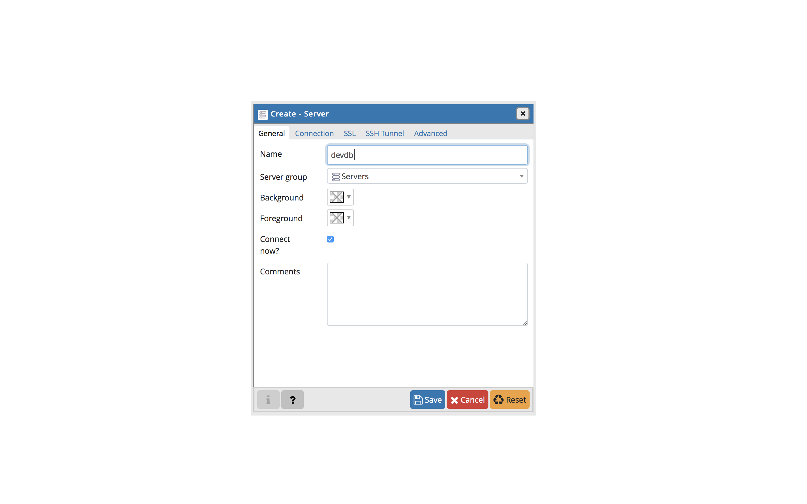
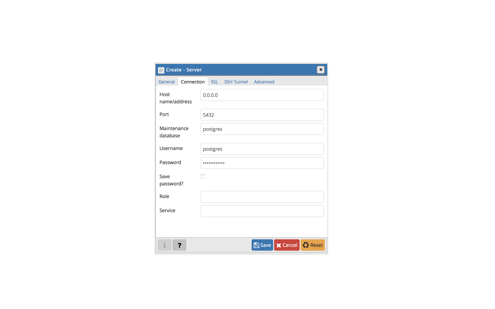

# Welcome to HelloDereks smart FAQ

Requirements:
- Have python 3 installed
- Have pip3 installed
- Have docker installed

First we need to check you have the correct node version

Now lets clone the repo, go to the folder you want the app to run and open a terminal in that folder

    git clone https://gitlab.paris-digital-lab.com/mokoloco/derek-back.git

Now install the dependencies 

    npm install

Now there are two ways to run the app, localy for dev purposes or on a remote server on heroku for production

1.  Local deployment

    a.  Launch a PostgreSQL server on your machine.

    In order to do that you first need to install postgre: https://www.postgresql.org/download/. Follow the installer and check the pgAdmin 4 option to have it installed on your machine.
    Once the install is done launch the pgAdmin 4 app, it will open a browser tab. On the dashboard click add a new server. Fill the information as shown below with the password being: lemotdepasse

    

    b. Setup the python environment

    Create a vitual environment and activate it with:

        python3 -m venv venv
        source venv/bin/activate
    
    Now lets import spacy and the french language

        pip3 install spacy
        python3 -m spacy download fr_core_news_sm

    c. Launch the server

    In the console in the app folder run:

        npm run devstart 
    
    And thats it you have the server running ready to accept incoming messages
    To access the database you will have to launch the front (the tutorial to do that is in the read me of the front git repository)
    To send the messages use the "send local message" request in the shared postman collection.

2. Remote deployment

    a. Login to docker

    First make sure you have docker installed (see this to install https://runnable.com/docker/install-docker-on-macos) and that it is currently running on your computer
    In the console at the root folder of the app type

        docker login --username=_ --password=$(heroku auth:token) registry.heroku.com

    b. Push the image to heroku

    Now all thats left is to push the app to heroku and to release it, in the same console type:

        heroku container:push web --app dty-derek
        heroku container:release web --app dty-derek
    
    Thats it the app is now running on heroku